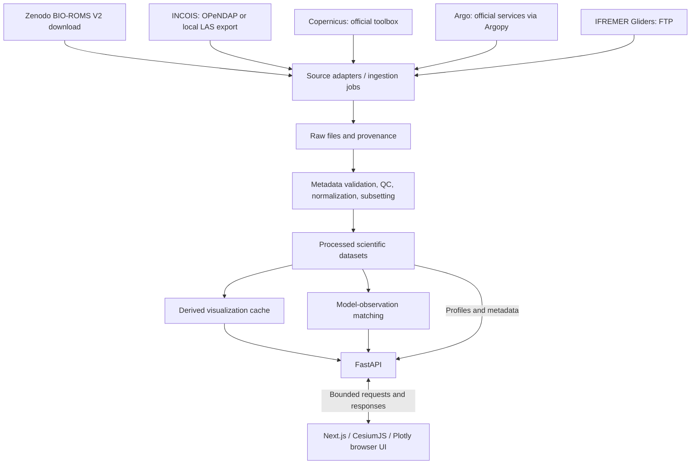

# Project Ocean Architecture

## All-date surface archive — 2026-09-28

Presentation identity is stable across compatible batches; request identity still includes the actual product ID and local frame index. The previous frame/metadata remain labelled during loading, and one next source frame is prefetched with cancellation through bounded caches (three frames / 6MiB). Dataset/variable/region changes invalidate incompatible display state. User-requested visual transitions now blend two prepared rasters over 480ms using smoothstep opacity, with source-over compensation to avoid a brightness dip in overlapping valid cells. Both source timestamps and a display-only label remain visible during the fade; scientific arrays, inspection, comparisons and exports are never temporally interpolated. A maximum of two scalar imagery layers coexist; superseded transitions finish before a new layer is added and old GPU layers/animation callbacks are released. App/browser reduced-motion preferences skip the fade. Plot metadata wraps in HTML outside Plotly; PNG exports temporarily include that metadata in the image, then restore the screen layout.

Source dates are served via immutable four-timestamp products, not raw-file reads in HTTP. Catalogue entries include exact selected region; the frontend merges only matching dataset/mode/variable-set/region batches into one timeline and maps each source timestamp to its owning product and local frame index. Per-product memory/work/response limits remain unchanged; only catalogue capacity increases to 128. Source-chunk-aligned bounded spatial tiles avoid repeated decompression. Analysis point series remain explicitly selected-batch scope, not a fabricated full-archive curve.

## Current frontend integration — 2026-09-28

Time-entry boundary: the UTC calendar/text draft is separate from active scientific selection. Apply resolves only exact instants in the selected product metadata and dispatches that original source timestamp. There is no nearest-time snap, interpolation, provider fetch or raw-file access. Product/time changes reset the draft; the existing DataProvider membership guard remains in force.

See [integration contract](docs/FRONTEND_INTEGRATION.md). Next.js/React/TypeScript + Cesium + Plotly now run from `frontend/`. Browser requests use same-origin `/backend/*`; fixed Next rewrites forward only health/readiness and `/api/v1/*` to server-only `OCEAN_BACKEND_URL`. No provider credentials, downloads, raw NetCDF or computation enter the browser/startup.

`DataClient` retains bounded reads, cancellation/cache/error guards. `backendAdapter.ts` explicitly maps FastAPI wire responses into recovered UI types; units/QC/raw-adjusted evidence are preserved, rejected QC is not plotted as valid, missing capabilities stay disabled. Saved comparison snapshots use their own guarded contract and fixed source/time selection, not the Explorer selection. Assumptions, exclusions and `comparison_ready=false` stay visible. Display interpolation never feeds scientific comparison.

This approved integration supersedes earlier no-frontend status/permission notes below; it does not change scientific source decisions.

## Local acceptance boundary — 5.10

[5.10](docs/MILESTONE_5_10.md) adds an operator-only development verifier: authenticated exploratory replay → saved identity/projection consistency → read-only API pagination/failures and repeated measurements. It never publishes, modifies scientific policies or runs at startup/health. Existing pure/scientific/storage contracts are reused, so this is not independent scientific validation. Real loopback HTTP confirms transport for all 13 implemented paths; browser/deployment/multiuser performance and missing depth/current/profile/source capabilities remain separate. Next frontend work requires approval. Historical implementation status below is superseded only where documented by these current milestones.

## Current comparison-serving boundary — 5.9

[5.9](docs/MILESTONE_5_9.md) adds explicit operator publication and read-only snapshot serving. `prepare_comparison --accept-assumptions` → authenticated matching/metrics → private evidence + allowlisted public projection → immutable `data/comparisons/c_.../` directory. An exclusive publication lock and final directory rename prevent cooperating writers from publishing partial results; conflicts are rejected. The API exposes catalogue, metadata and filtered/paged samples, never the private report or source paths/stat records. HTTP validates bounded prepared JSON only; no provider, NetCDF, matching or publication call occurs. A snapshot's preparation time is not a live source-freshness assertion; strict science and `/ready` semantics are unchanged. This supersedes earlier no-API descriptions below without promoting assumptions to verified comparisons.

## Current metrics architecture — 5.8

[5.8 exploratory metrics](docs/MILESTONE_5_8.md) is a private operator layer over authenticated exploratory matching. `scripts.run_exploratory_metrics --accept-assumptions` → existing matching/file checks → pure equal-sample residual/bias/RMSE calculation → bounded `ExploratoryMetricsReport`. The report embeds matching provenance/assumptions/exclusions, binds it by canonical hash and recomputes derived arithmetic during validation. No arbitrary saved-report input, source write, acquisition, HTTP handler or startup hook exists. Empty pairs give null metrics; partially blocked selections retain that status and summarize only accepted pairs. Scientific verification/independent-validation flags remain false. API/publication is the next separately approved part; earlier no-metrics notes below are historical.

## Current matching architecture — 2026-09-27

[5.7 exploratory workflow](docs/MILESTONE_5_7_EXPLORATORY.md) adds a separate operator path, not an evidence override. Both paths use authenticated local assembly and post-run input checks. Strict execution calls the unchanged guarded engine; exploratory execution retains its assessment, recomputes static diagnostics, and uses shared numerical selection with separately declared assumed time/nominal-depth/grid support. Real data stays real; raw sources and strict policy are immutable.

`scripts.run_exploratory_matching --accept-assumptions` → authenticated inputs → strict QC/quantity/depth assessment → assumption-labelled shallow salinity selection → bounded `ExploratoryMatchingReport` JSON. No health/startup/network/API hook exists. The actual 14-row selection yields 2 exploratory pairs; this is not verified readiness or independent validation. Assumptions, citations, source-specific scope and exclusions are documented in the milestone. Earlier checkpoint notes below predate this scope change. INCOIS, Copernicus, Argo and gliders remain required; this experiment does not claim matching support for the other sources.

## Status and scope

This file preserves design and implementation status in `C:/Users/pc/OneDrive/Desktop/ocean_2`. Parts 1–3 provide health, local V2 inspection/preparation, scientific/preview products and surface APIs/readiness. Approved part 4 adds bounded operator source acquisition, scientific observation QC/normalization/storage and typed observation/acquisition APIs. Source-specific live limitations remain; quantity conversions/comparison, depth/current serving and frontend are not complete. Current evidence is in [docs/MILESTONE_4.md](docs/MILESTONE_4.md); earlier milestones are historical checkpoints.

The system must display numerical ocean model data and in-situ observations in one browser environment. INCOIS, Copernicus Marine, Argo, and IFREMER gliders all remain required sources. Scientific comparisons operate on compatible variables with overlapping location, depth, and time.

The user prioritizes smooth interaction and scientific correctness. The local Zenodo V2 file is now checksum-verified and inspected; its first SST/SSS selection is prepared. Acquisition/preparation remains separate from startup and browser requests. Ask permission between the remaining backend parts and build frontend last as defined in [BACKEND_DEVELOPMENT_PLAN.md](BACKEND_DEVELOPMENT_PLAN.md).

## Latest 5.7-A boundary

Latest [5.7-C local execution](docs/MILESTONE_5_7_EXECUTION.md) adds a coordinator over the existing readers, quantity/depth audit, static diagnostics and matching engine. It binds/rechecks input identities and passes native values/masks to the kernel, preserving unknown physical-support fields. The engine retains its unconditional real-mode guard and returns before pair selection. A typed blocked execution report separates spatial diagnostics from engine results; no real-success contract, metrics or API is introduced. Earlier A/B descriptions below remain valid for their separate audit commands.

Subsequent [5.7-B spatial diagnostics](docs/MILESTONE_5_7_SPATIAL_SUPPORT.md) bind verified Argo positions to candidate and bracketing static columns without calling the matching kernel. They preserve both model and global-static index systems, source mask-derived depth coordinates and separate geoid bathymetry. The bracketing set is not an asserted cell polygon: all-wet nodes cannot certify sub-grid observation connectivity. Physical observation-support fields remain null and all policy gates remain in force. Scientific decisions are still required before 5.7-C.

The [offline static-support reader](docs/MILESTONE_5_7_STATIC_READER.md) now binds the acquired mask/bathymetry snapshot to a verified prepared model. It reconstructs arrays from the exact retained compressed read set, validates subset values/attributes and checks identities before/after reading. This detects inconsistent local changes even if a subset hash was regenerated. Source elevation ordering is retained with an explicit model-depth index mapping. The partial read set is never opened as a complete global store. No network, writes, API or matching-kernel call occurs; scientific interpretation and observation binding require separately approved 5.7-B/5.7-C work. A successful read cannot set wet/bottom/connectivity evidence flags.

## Components and data flow

The diagram describes the complete target system, not all completed integrations. Current flows include explicit local V2 inspection/preparation and operator source acquisition → separate observation normalization → immutable local manifests/scientific samples → read-only APIs. Health remains dependency-free; readiness checks configured Part-3 surface products only. Acquisition/normalization never run at app construction or in HTTP handlers. The acquisition inventory reads private manifests/stat only, not raw NetCDF contents.

| Component | Responsibility and boundary |
| --- | --- |
| Source registry | Dataset IDs, endpoints, aliases, verified coverage, variable mappings, and inspection status; credentials come from server configuration. |
| Ingestion adapters | Discover and fetch bounded data, preserve source metadata, and record provenance; keep provider-specific behavior here. |
| Processing | Validate dimensions and calendars, apply declared QC, normalize scientific quantities, and produce subsets; independent of the web framework. |
| Storage | Preserve raw inputs, publish versioned processed products, and manage replaceable visualization caches. |
| Comparison | Match observations against processed model fields and return differences with match diagnostics. |
| FastAPI | Validate requests and return metadata, bounded fields, tracks, profiles, and comparison results. |
| Browser UI | Use CesiumJS for the geographic scene, React for panels/controls, and Plotly for scientific graphs; request only data needed for the current view. |

Ingestion and expensive preparation initially run as explicit operator jobs outside browser requests. The API reads prepared data; bounded cache misses may compute only within configured interactive resource limits. Profile inspection uses processed scientific samples with QC/provenance, while display layers may use downsampled caches. If a larger requested product is not prepared, return `not_prepared`. Once a persistent job worker exists, the API may return a job identifier with HTTP 202 for accepted work and expose progress/status separately. Do not report a queued job without an actual worker; a distributed queue is not required for the first prototype.

The browser shares one region/time/depth selection across layers. Each layer also reports its own availability. Cancel obsolete requests when controls change. Frame animation must display actual data times and avoid presenting missing frames as new measurements.

## Decisions and reasons

| Decision | Why |
| --- | --- |
| Keep all four source families | Models provide gridded fields; observations provide sampled measurements for overlays and comparison. |
| Process raw NetCDF on the backend | Full scientific files exceed practical interactive browser workloads and need metadata-aware processing. |
| Retain both INCOIS OPeNDAP and local-file ingestion | Development can progress during server/network delays without changing the final source integration. |
| Use prepared local Zenodo V2 as the BIO-ROMS default | Interactive use no longer depends on a slow live OPeNDAP request; source version and repeatability remain explicit. |
| Keep the globe usable while layers prepare | A source delay should affect its own layer, not navigation or other tabs. |
| Separate source adapters from shared processing | Provider formats and access methods vary; visualization should not depend on them. |
| Compare before display downsampling | Rendered grids can omit or alter information needed for scientific matching. |
| Keep raw, processed, and display data distinct | Raw inputs support reproducibility; derived data can be regenerated when processing changes. |
| Start with local storage | A small prototype does not yet justify a database, distributed queue, or cloud storage dependency. |
| Inventory NetCDF headers before reading coordinates/fields | Part 2 uses netCDF4 directly to avoid implicit coordinate-index materialization; xarray now handles part-4 adapters only after bounded preflight. Header inspection is not scientific validation. |
| Keep direct netCDF4 for the first inspected surface processor | Part 3 reads one selected variable/frame at a time with explicit source-chunk and cache ceilings; no extra xarray/Dask dependency is needed for this fixed rectilinear adapter. Later adapters can adopt xarray without changing public contracts. |
| Publish distinct scientific and preview files behind a final manifest | Scientific samples retain resolution; preview decimation cannot leak into point series or future comparison. Incomplete output never becomes a selectable product. |
| Keep published registry entries separate from inspection reports | A recorded endpoint, checksum, or product description does not prove current local contents, access, or readiness. |
| Use CesiumJS with Next.js/TypeScript and FastAPI | CesiumJS is the planned frontend globe foundation; the implemented Python API foundation fits the later scientific stack. |
| Implement backend parts first, frontend last, with approval between parts | Matches the user's requested execution order and provides a verified checkpoint before extending scope. |
| Use Plotly.js for scientific charts | One charting layer supports interactive profiles, time series, sections, and model-observation graphs. |
| Keep credentials server-side | Source access is a backend responsibility, and browser configuration is visible to users. |

The default comparison box is longitude 30–120 and latitude -30–30. Date, depth, and variable selection must be explicit. Never infer that all sources cover the box or that their entire date ranges overlap.

## Frontend experience and rendering boundaries

The selected visual direction is a Google Earth-style launch: a full-window Earth against dark space, restrained Project Ocean branding, real loading states, and a smooth transition toward the Indian Ocean. The first usable screen is the globe explorer. Keep the globe prominent, with a compact navigation rail, collapsible layer panel, right-hand inspector, bottom timeline, and camera controls. The implementation prompt defines the detailed visual treatment; no reference screenshot was supplied or pixel-level match verified.

Primary tabs are **Explorer**, **Analysis**, **Profiles**, **Comparison**, and **Data Sources**. Settings belong in a compact drawer. All tabs share source/variable/region/time/depth selection and selected observation identity. Explorer handles layers and spatial selection; Analysis shows scientific plots; Profiles inspects Argo/glider samples; Comparison shows matched pairs and diagnostics; Data Sources reports capabilities, coverage, provenance, and access status. [Detailed frontend specification](FRONTEND_IMPLEMENTATION_PROMPT.md).

CesiumJS owns the main globe, camera, imagery, geographic overlays, and picking. Use client-only initialization and configure its static assets/workers for the chosen Next.js version. Plotly charts load when their panel is needed. Cesium supports geospatial layers and custom geometry; globe translucency helps expose subsurface data, but scientifically meaningful ocean volumes require custom data preparation and rendering. [CesiumJS capabilities](https://cesium.com/learn/cesiumjs-learn/), [globe translucency](https://cesium.com/learn/cesiumjs/ref-doc/GlobeTranslucency.html), [Plotly React integration](https://plotly.com/javascript/react/).

Prototype a bounded ocean volume before choosing its renderer. Prefer Cesium-compatible rendering; if insufficient, use a dedicated, separately mounted Three.js volume view synchronized through the shared selection. Do not assume two renderers share a camera or depth buffer automatically. Convert scientific depth to geographic height using an explicit vertical reference; bathymetry, ellipsoid heights, and depth below sea surface are not interchangeable.

Use an explicitly configured imagery/terrain provider with visible attribution. A basic globe must remain usable when provider credentials or network access are unavailable. Google Photorealistic 3D Tiles are an optional imagery integration, not a source of ocean measurements or a default dependency. Google's renderer integration requires the appropriate API configuration and attribution; billing must be considered before enabling it. [Google renderer integration](https://developers.google.com/maps/documentation/tile/use-renderer), [usage and billing](https://developers.google.com/maps/documentation/tile/usage-and-billing).

## Part-4 acquisition and observation boundary

Provider acquisition is an explicit operator job with a killable subprocess deadline and byte/shape limits; it publishes immutable raw inputs plus provenance under `data/raw/acquisitions/`. Source success is `acquired_not_prepared`. Copernicus uses explicit process-only credentials and dataset/version selection; GODAS requires inspected aliases; Argo preserves the original ERDDAP response and records expert-client transformations; glider FTP preserves one complete bounded deployment file. Verified TLS remains enabled. No source fallback or retries happen invisibly in HTTP requests.

Observation normalization selects at most 5,000 native samples, keeps raw/adjusted values and QC/exclusion reasons, and preserves declared packing/range metadata. Coordinates outside declared valid ranges fail rather than being silently repaired. EGO coordinates are scanned in 4,096-row chunks (at most one million source rows), retaining only selected rows before science reads; Argo input remains capped at 100,000 rows. Other metadata/file/chunk/response limits are explicit in the [part-4 guide](docs/MILESTONE_4.md). GPS fixes and sensor arrays are never aligned by row number; ambiguous point groups never acquire invented profile IDs.

Scientific collections publish atomically under `data/observations/` with a 16 MiB snapshot ceiling. Read-only APIs expose safe metadata and 1–500 native samples per page, bounded by 2 MiB JSON. Collection hashes/identities are checked; raw files are not opened by observation HTTP routes. A page may validate the full bounded collection; no database-style constant-time paging is claimed. `/api/v1/acquisitions`, `/api/v1/observations` and the surface `/api/v1/datasets` catalogue describe distinct stages. `/ready` remains explicitly configured surface-product readiness, not universal source readiness. Model acquisitions require additional verified preparation before depth/current serving; part 5 comparison and part 6 frontend remain permission-gated.

## Source registry: preserved findings

### Implemented part-3 preparation and serving

The verified V2 now contains 480 TIME samples, 756 LAT samples, and 1,081 LON samples; LAT/LON/TIME are finite and strictly increasing. Actual centre ranges are LAT `-29.996871948242188` to `29.977840423583984`, LON `30` to `120`; decoded time runs `1980-01-24T00:00:00Z` to `2019-12-25T00:00:00Z`, with source units `days since 1980-01-24 00:00:00` and `proleptic_gregorian` calendar. Do not assume evenly spaced latitude or month-start timestamps. Original source metadata does not declare temporal bounds/cell methods for these fields; none are invented.

Confirmed scalar fields are `SST`, `SSS`, `MLD`, `DIC`, `CHL`, `NO3`, `pCO2_Int`, `pCO2_Clim`, `pCO2_Original`, and `Deviant_uncertainty`, all `(TIME, LAT, LON)`. There is no vertical coordinate or current component in this file. Surface temperature/salinity and MLD do not enable a water-column view. Source units/names are preserved verbatim, including unusual capitalization/spelling; no complete CF compliance or scientific quantity harmonization is claimed. The embedded global DOI references the older record, but the bytes match the published V2 checksum; retain both facts rather than editing the input.

`prepare_product` requires a saved checksum-verified inspection whose source identity, registry origin/version/path and size/mtime still match the local file. It validates numeric 1D TIME/LAT/LON, supported real-world Gregorian calendars, exact inspected V2 units, and scalar dimensions before selecting inclusive dates and intersecting cell centres. Dateline wrapping, descending/curvilinear coordinates, unsupported QC/ancillary metadata, unsupported calendars/units, and no-overlap requests fail explicitly. A requested box may extend beyond the outer cell centres; only intersecting samples are returned, with actual axes recorded. No geographic or temporal extrapolation occurs.

Before reading fields, enforce `config/performance.yaml`: up to 4 variables, 12 timestamps, 366 days, 8 million selected variable-values, and bounded decompressed source chunks. Read one selected frame at a time with per-variable caches capped. Decode source packing/missing masks into float64 and map nonfinite values to missing. Keep original encoding/global attributes as private NetCDF provenance, not active output scale/offset attributes. No per-observation QC, scientific conversion, or comparison policy is implemented; manifests state `source_mask_and_nonfinite_only`, `source_definition_not_harmonized`, and `comparison_ready: false`.

Product IDs hash the selection, source MD5, processing version, resource policy, and data mode. Scientific outputs live in `data/processed/<product_id>/fields.nc`; strided source-cell previews live in `data/cache/<product_id>/preview.nc`. Both carry source/processing identity. There is no preview averaging or interpolation. The manifest records actual axes/times/units, input identity, SHA256/stat identities of prepared files, display stride, capabilities, and real/synthetic label. Save private temporary files, publish the cache directory first, then the processed directory including the manifest as the completion marker. Existing unchanged output is reused after verification; conflicting output is not overwritten. An interrupted job can leave an unreferenced cache requiring operator review, not a ready product.

`ProductStore` resolves bounded private paths and validates manifest/expected file identities. The catalogue preserves all source families without making provider connections; only actual prepared selections are ready. It exposes safe typed metadata, never raw paths, full attributes, or private file records. Frame/series requests use only prepared files, validate their shape/axes/timestamps/units, and recheck stat identity after reading. JSON uses finite numbers or `null`, labelled axis order and actual coordinates/time. Preview frames have at most 16,384 cells; scientific frames at most 65,536 cells, requiring a smaller bbox for the full regional grid. All response bodies are capped at 2 MiB, including runtime response-model validation. One nonblocking lock serializes NetCDF reads per API process; concurrent scientific work returns `503 busy`, while health remains independent. No on-demand processing queue or HTTP write route exists.

Point time-series read native scientific samples at the nearest axis-grid cell within actual centre support. Return requested/sample locations, index, actual times, and great-circle offset. Do not search for another wet cell, interpolate, assign a numeric sea-surface depth, or label this as observation matching. The explicit `display_only`/`comparison_result` fields prevent confusing previews or point lookups with scientific validation.

The real starting product is `p_7c8210052d41d41259724e2d`, SST/SSS selected for January–March 2019 over the full comparison box. Actual dates are January 29, February 28, and March 30. Scientific shape is `3 × 756 × 1081`; stride-8 previews are `3 × 95 × 136`. See [verification](docs/MILESTONE_3.md) and [backend measurements](docs/performance.md). Other listed V2 fields remain available for an explicit bounded preparation, not precomputed in this checkpoint.

### Implemented part-2 inspection boundary

`config/data_sources.yaml` is a versioned, size-limited registry containing local BIO-ROMS V2, four GODAS years, Copernicus, Argo and IFREMER gliders. Registry notes are published claims, not inspected variable mappings. The part-2 local inspector remains separate: remote entries report `not_configured` / `local_inspection_not_applicable`, while part-4 acquisition adapters have their own explicit operator workflow and inventory. No local-inspection status command contacts providers.

The operator CLI `python -m scripts.inspect_dataset` provides `status` and `inspect`. `status` checks the configured final path's filesystem information only. It does not read raw data or prior reports; an existing local file is `uninspected` until explicitly inspected. Partial filenames are ignored; Windows offline/recall placeholders are reported unavailable rather than intentionally opened. Local inputs must resolve below this project's `data/raw/` folder, including symlink checks.

`inspect` opens a completed local file read-only through netCDF4 and records real variable/dimension names, shapes, types, storage chunks, and global/variable attributes, including units, calendars, packing, fill values, and QC declarations. Coordinate candidates are evidence-labelled hints, not verified geometry. No coordinate or field values are read; coverage contains only declared global attributes labelled unverified, and `capability_status` stays `not_evaluated`. Masks/QC are documented, not applied. Actual extents, monotonicity, time decoding, scientific compatibility, and surface/depth/vector capability checks belong to preparation after permission.

Inspection outcomes are `unavailable`, `uninspected`, `invalid`, `unsupported`, or `not_prepared`; remote adapters additionally use `not_configured`. A successful header inventory remains `not_prepared` with `prepared: false`, even when checksum verification succeeds. Known prototype limits and unsupported NetCDF structures are explicit failures, not truncated success. Part 2 creates no `/ready`, catalogue HTTP route, processing job, or browser layer.

Optional `--verify-checksum` streams every file byte in 1 MiB blocks and checks the published MD5 (`78b7c0fbaa00db58a31563bb442a693b` for the registered V2). MD5 is an integrity comparison with the publisher, not an authentication guarantee. File size/mtime are compared around inspection to detect ordinary concurrent changes; these are not an immutable snapshot. The default header-only command leaves checksum unverified. Optional `--save` atomically publishes or replaces `data/metadata/<dataset_id>.json`, outside raw input storage; reports record inspection time, source identity, file stat identity, checksum outcome, and metadata. Inspection time is not a known download/acquisition timestamp. Saved reports are snapshots, not automatically trusted readiness inputs.

The inspector caps dimensions, variables, attributes, attribute sizes, and serialized output. It rejects hierarchical groups and unsupported custom variable types. These are prototype constraints, not proof that a source is scientifically invalid. NetCDF library allocations while opening headers/reading an attribute cannot be bounded before the library returns; accept only trusted local operator files, not arbitrary public uploads. See [exact limits](docs/MILESTONE_2.md). Part 2 did not install xarray/provider clients; part 4 now uses them in separate explicit adapters. [netCDF4 API](https://unidata.github.io/netcdf4-python/), [xarray dataset-opening behavior](https://docs.xarray.dev/en/stable/generated/xarray.open_dataset.html).

### Local V2 ingestion and preparation

1. Download the recommended V2 once as an operator task, preserving its published filename under `data/raw/incois/bio_roms/v2/`. Check available disk space for the original, temporary files, and derived products. Verify the published checksum before registering it as ready; keep partial downloads separate and resume only when the server supports it.
2. Record the Zenodo record/DOI, version, checksum, acquisition time, and attribution. Inspect actual variable names, units, dimensions, masks, coordinate ordering, and time coverage. The LAS identifier and the Zenodo record remain distinct acquisition identities even when their data is related.
3. Select required variables, dates, and region before materializing arrays. The published V2 region already matches the project box; cropping to that same box does not reduce its spatial extent. Use smaller subregions only when the user requests them.
4. Preserve scientific resolution and meaning in `data/processed/`; create separate display resolutions in `data/cache/`. Prepare the starting selection and coarse previews first instead of generating every possible time/region combination.
5. Publish outputs atomically with a manifest and capabilities. Only validated products become selectable as ready data. Subsequent viewing reads local prepared data and does not require another Zenodo or OPeNDAP connection.

Start with local NetCDF subsets. Where larger computations need it, explicitly declare and test Dask's array support and use bounded chunked processing; choose chunks after inspecting the on-disk layout and real access patterns. Benchmark before adding a derived Zarr store. Avoid whole-dataset `.load()`, `.values`, `.compute()`, or DataFrame conversion before subsetting. Disk reads can exceed the logical subset because of storage chunks/compression, so measure memory and I/O rather than assuming lazy access guarantees speed. [xarray chunking and lazy computation](https://docs.xarray.dev/en/stable/user-guide/dask.html).

### INCOIS BIO-ROMS

BIO-ROMS is a coupled physical-biogeochemical model system. Its published products contain multiple variables. The INCOIS authors' description of `pCO2-Corrected_INCOIS-BIO-ROMS.nc` explicitly lists SST, sea-surface salinity, mixed-layer depth, nitrate, dissolved inorganic carbon, and chlorophyll-a alongside model/corrected pCO₂ fields. The described product covers 1980–2019 at monthly resolution. A corrected-pCO₂ filename does not establish that temperature or salinity is absent. [Published file description](https://zenodo.org/records/13802393).

The authors recommend [version v2](https://zenodo.org/records/14614739), named `pCO2-Corrected_INCOIS-BIO-ROMS_v2.nc`; v1 is deprecated. The recorded LAS dataset ID is `d272905813`, but its currently hosted version, exact variable names, units, and dimensions have not been inspected. Do not silently replace the recorded URL or assume it serves v2. Register and inspect each chosen service/file, exposing every supported variable.

[Recorded pCO₂ OPeNDAP endpoint](https://las.incois.gov.in/thredds/dodsC/las/id-d272905813/data_home_las_datasets_pCO2_pCO2-Corrected_INCOIS-BIO-ROMS.nc.jnl)

A separate published `INCOIS_BIO_ROMS.nc` product lists surface temperature, salinity, DIC, alkalinity, pH, and pCO₂. Keep its identity separate from the corrected-pCO₂ release. [BIO-ROMS model-output description](https://zenodo.org/records/11670413). Verify whether an additional endpoint is needed from actual metadata rather than assuming one endpoint per variable. Surface fields and mixed-layer depth do not establish the availability of full vertical profiles; inspect dimensions before enabling depth slices or volume rendering.

### INCOIS GODAS

| Year | Dataset ID | Recorded OPeNDAP endpoint |
| --- | --- | --- |
| 2025 | `cbbdd5ab07` | [2025 dataset](https://las.incois.gov.in/thredds/dodsC/las/id-cbbdd5ab07/data_home_las_datasets_godas_2025.nc.jnl) |
| 2024 | `1bb8b13c5b` | [2024 dataset](https://las.incois.gov.in/thredds/dodsC/las/id-1bb8b13c5b/data_home_las_datasets_godas_2024.nc.jnl) |
| 2023 | `eeb330b387` | [2023 dataset](https://las.incois.gov.in/thredds/dodsC/las/id-eeb330b387/data_home_las_datasets_godas_2023.nc.jnl) |
| 2022 | `fe1698c540` | [2022 dataset](https://las.incois.gov.in/thredds/dodsC/las/id-fe1698c540/data_home_las_datasets_godas_2022.nc.jnl) |

Intended use is physical fields such as temperature, salinity, and currents where exposed. Exact variable names, vertical coordinates, grid geometry, and time coverage remain unconfirmed. Do not reuse Copernicus variable mappings without inspecting GODAS metadata.

Prior Windows tests timed out after 120 seconds for the pCO₂ endpoint and 60 seconds for GODAS. Certificate verification initially failed; disabling verification diagnostically still timed out. An alternate HTTP F-TDS attempt also timed out. These are local/server-response observations, not proof of invalid datasets. Keep TLS verification enabled in implementation, use bounded timeouts/retries, and distinguish transport failures from metadata/data validation failures. A small manual LAS NetCDF export is the agreed development fallback. During the documentation correction on 2026-09-09, the browsing tool could not retrieve the LAS catalogue or selected pCO₂ endpoint's DDS metadata. The published dataset descriptions above were accessible; the live LAS variables/version and GODAS access remain unverified.

### Copernicus Marine

Use product `GLOBAL_MULTIYEAR_PHY_001_030` through the official Marine Toolbox. The current product page describes a physical reanalysis with potential temperature, salinity, and currents. [Official product catalogue](https://data.marine.copernicus.eu/product/GLOBAL_MULTIYEAR_PHY_001_030/description).

The official product manual confirms daily `cmems_mod_glo_phy_my_0.083deg_P1D-m` and monthly `cmems_mod_glo_phy_my_0.083deg_P1M-m`; the adapter restricts selection to these product-specific IDs and requires an explicit operator-verified version. Recorded aliases remain `thetao` (potential temperature), `so` (salinity), `uo` (eastward current), and `vo` (northward current). Inspect units, averaging, depth and vector orientation before scientific use. [Official product manual](https://documentation.marine.copernicus.eu/PUM/CMEMS-GLO-PUM-001-030.pdf).

Only the server or ingestion operator authenticates. Use the credential names documented in [README.md](README.md). Cache keys and provenance must identify the selected dataset/version, not just the broad product name.

On 2026-09-10, the official catalogue verified daily version `202311`; verification-only toolbox authentication accepted the supplied temporary credentials without saving a login file. The [live dataset STAC](https://s3.waw3-1.cloudferro.com/mdl-metadata/metadata/GLOBAL_MULTIYEAR_PHY_001_030/cmems_mod_glo_phy_my_0.083deg_P1D-m_202311/dataset.stac.json) exposes negative `elevation`; the SDK explicitly converts sign/order/name to positive-down `depth` in metres. The adapter records this client transformation and CF decoding/re-encoding. This is not temperature/salinity harmonization. The shallowest advertised level is `0.49402499198913574` m, so a strict-inside lower bound of 0 m is rejected even though the interval partially overlaps. Such rejection is not proof of missing data. Source timestamps and separately documented temporal averaging must be inspected without silently shifting midnight to noon. See [follow-up evidence](docs/MILESTONE_4.md) and the bounded example in `config/acquisition.copernicus.example.json`.

Real subset `a_9e918d43555ffc26d3659e08` is now acquired and rehashed: 54,832 bytes, four fields, two actual midnight timestamps Jan29–30 2019, eight depths 0.494025–9.572997 m and 13×13 cells at 65–66E/1S–0N. The file preserves source units, standard names, int16 packing and `area: mean`, with no time-bounds variable. This is `acquired_not_prepared`, not a served model layer or a full water column. No comparison is enabled by these matching date/region bounds alone.

### Argo Global

Recorded source repository: [IFREMER Argo GDAC](ftp://ftp.ifremer.fr/ifremer/argo). Argopy is a client for official Argo services/GDAC infrastructure, not the owner or repository of the data. Record which service/backend Argopy uses in each acquisition. Historical and recent archive access are both in scope; the handoff describes coverage from roughly 1999 onward, with sparse early years.

Core fields include `PLATFORM_NUMBER`, `CYCLE_NUMBER`, `DIRECTION`, `LATITUDE`, `LONGITUDE`, `PRES`, `TEMP`, `PSAL`, and their applicable QC fields. Raw GDAC profile files use `JULD` for profile time; Argopy DataFetcher processing exposes it as `TIME`. Retain the corresponding time/location fields and QC, including `JULD_QC`, `JULD_LOCATION`, and `POSITION_QC` where present, and record any client renaming. Direct NetCDF readers must inspect the source names rather than assume `TIME` exists. [Argopy time-name handling](https://argopy.readthedocs.io/en/v1.3.0/_modules/argopy/xarray.html).

Preserve applicable adjusted values, adjusted QC, errors, and data modes when available. Optional BGC variables such as `CHLA`, `DOXY`, `NITRATE`, `PH_IN_SITU_TOTAL`, and backscatter depend on the float and product; inspect exact names. Profile identifiers must distinguish platform, cycle, direction, and any separate profiles within the source file.

Argopy's region order is `[lon_min, lon_max, lat_min, lat_max, pressure_min, pressure_max, start_date, end_date]`. The common box example is `[30, 120, -30, 30, 0, 2000, start_date, end_date]`; pressure is in dbar. A 0–10 dbar selection is a near-surface sample window, not automatically equivalent to a model or satellite SST definition.

Record Argopy's user mode, data mode handling, and QC filtering so that automatic client processing is not mistaken for untouched raw data. [Argopy user-mode documentation](https://argopy.readthedocs.io/en/v1.3.0/user-guide/fetching-argo-data/user_mode.html).

Part-4 live Argo acquisition `a_d30181bd8998aca81bb33be1` is now normalized as `o_c645f248f801845378f0fdaf`: 14 near-surface January29, 2019 points from two floats, preserving raw/adjusted core values and QC. Values were checked exactly against the saved provider response. The ERDDAP point representation does not prove separate profile identity, so these remain `ambiguous_points` with profiles disabled. No comparison result is claimed. [Verified source details](docs/MILESTONE_4.md).

### IFREMER Gliders

Recorded repository: [IFREMER Glider v2](ftp://ftp.ifremer.fr/ifremer/glider/v2/). Part 4 repeated the exact Bella FTP acquisition successfully: 45,337,024 bytes, `a_9cbe844e66f3fbb520b0d235`, retained privately with original basename/provenance. Real metadata show 235,791 sensor samples and 566 separate GPS fixes. `FLUORESCENCE_CHLA` uses `count`. TIME's declared valid maximum of 90,000 conflicts with its approximately 1.707e9 epoch-second values; normalization rejects this as `invalid_coordinate_metadata` instead of silently overriding it. Sampled QC is missing. No scientifically ready glider collection or comparison overlap is claimed; [part-4 evidence](docs/MILESTONE_4.md) records the details.

Reported metadata: `data_type=EGO glider time-series data`, `format_version=1.2`, `platform_code=Bella`, `data_mode=R`, and `naming_authority=EGO`.

Confirmed fields in the prior test include `TIME`, `TIME_GPS`, `LATITUDE`, `LONGITUDE`, `LATITUDE_GPS`, `LONGITUDE_GPS`, `PRES`, `GLIDER_DEPTH`, `TEMP`, `PSAL`, `FLUORESCENCE_CHLA`, `CNDC`, `SIGMA_T`, `GLIDER_PITCH`, `GLIDER_ROLL`, and QC variables. Sensor samples and GPS fixes may have different coordinates/dimensions; align them from metadata rather than row order.

Some early `PSAL` values were missing. Temperature around -1.12 °C was consistent with the reported Antarctic location near 63.68°S. That location is **outside** the comparison box: this sample validates acquisition and parsing, not Indian Ocean model-observation overlap. Interpret `FLUORESCENCE_CHLA` from its metadata, units, and calibration before labeling it as chlorophyll concentration.

## Shared scientific data contract

### Implemented Part-5.2 model contract

[MODEL_PREPARATION_CONTRACT.md](docs/MODEL_PREPARATION_CONTRACT.md) defines native-depth preparation. Schemas remain I/O-free; Part 5.3 adds `processing/prepare_model.py` and operator `scripts/prepare_model.py`. Hash/stat/metadata preflight precedes bounded slab reads; raw-domain fill/range masks and one float64 packing decode preserve native samples. Typed metadata retains original attributes, dtype/shape and discrepancies. Every selected slab is readback-checked before immutable publication in `data/models/m_.../`, preserving existing surface storage and `/ready`.

Real product `m_35e4c0ab33c1469a334ca837` retains four fields at 2×8×13×13 with exact equality to acquired decoded values. Reuse verifies full identity, output hashes, metadata and readback. An exclusive publication lock protects cooperating writers; conflicts are never overwritten. Temporal/quantity/vertical/wet-domain gates remain unresolved; comparison and API serving stay false. [5.3 verification](docs/MILESTONE_5_3.md). Ask permission before continuing remaining 5.7 integration.

### Shared target representation

Source adapters preserve original names/attributes and produce a versioned internal representation. Keep gridded models as labeled arrays; observations remain samples grouped into profiles or tracks. Do not turn sparse observations into a continuous volume without an explicit, separately documented interpolation method.

| Item | Proposed contract |
| --- | --- |
| Identity | `source_id`, `dataset_id`, dataset version or input checksum, platform/deployment/profile identifiers where applicable |
| Coordinates | Named longitude/latitude in degrees east/north; public longitude normalized to `[-180, 180)`; original coordinate convention preserved |
| Time | UTC ISO 8601 for supported real-world dates, plus original time units/calendar and averaging interval; handle incompatible calendars explicitly |
| Vertical position | `depth_m` positive downward and separate `pressure_dbar` for sea pressure; retain the source pressure reference and model vertical-coordinate metadata |
| Variable | Semantic variable ID, original name, units, temperature/salinity definition, and conversion history |
| Quality | Original QC flags, declared QC policy, data mode, raw/adjusted selection, and missing-value mask |
| Provenance | Source location, retrieval timestamp, subset request, input identity, processing version, and applicable attribution |

The initial application should reject or explicitly mark unsupported calendars, grids, and units. Grid handling must inspect rectilinear/curvilinear coordinates, sigma levels, wet masks, and vector staggering/orientation before interpolation or rendering. Display vertical exaggeration belongs only in the renderer; scientific depths remain unchanged.

## Model-observation comparison

### Part-5.7 safe checkpoint — synthetic matching kernel

`schemas/matching.py` defines private native-grid/support inputs and pair/exclusion reports; `comparison/matching.py` implements bounded deterministic in-memory selection. `comparison/adjusted_depth.py` binds adjusted pressure and its reported error to the same collection/quantity sample identities, re-evaluates quantity diagnostics, and calls the existing GSW depth converter without rewriting sources. Matching recomputes that bridge to reject raw/adjusted or endpoint substitution.

The kernel selects the geographic nearest native column, verified containing daily interval, and nearest central-depth level before evaluating masks. Inclusive tolerances, stable native-index ties, full pressure-error endpoint support, candidate-bound connectivity and explicit exclusions follow [the canonical policy](docs/MATCHING_POLICY.md). Native values remain distinct from previews; results contain values/offsets/provenance, not residuals or metrics.

The matching kernel remains **synthetic only**. The continuation below now verifies native scientific fields, but scientific-support verification and real-kernel integration remain unfinished; real mode is explicitly blocked even if a caller supplies apparently verified support flags. Internal schema validation is not file authentication. Unknown per-sample support remains blocked, not genuine no-overlap. All reports retain `comparison_ready=false`. Existing policy preflight, API routes and source manifests remain unchanged. [Historical kernel checkpoint](docs/MILESTONE_5_7.md).

### Part-5.7 continuation — verified local inputs, matching still blocked

The approved [static acquisition checkpoint](docs/MILESTONE_5_7_STATIC_ACQUISITION.md) adds a separate operator-only public-HTTPS chunk reader, retaining exact source objects and a readback-verified50×13×13 subset in `data/raw/static_copernicus/`. It does not change the daily/monthly Toolbox adapter or expose a new API. Scientific support binding/interpretation remains unfinished: acquisition is not wet/bottom/connectivity evidence for an observation. Original negative elevation values and source attributes are preserved separately from the explicit sign/order alignment check. The later checkpoint supersedes the earlier no-download state in the historical paragraph below.

The later [support-evidence checkpoint](docs/MILESTONE_5_7_SUPPORT_EVIDENCE.md) identifies version202311's undownsampled static bathymetry part without downloading arrays. Its advertised depth list matches the distributed daily product; the separate coordinates part has small depth discrepancies and must not be joined blindly. Static support acquisition/validation remains permission-gated. Daily label-to-interval mapping and vertical-datum compatibility remain unresolved. In this project, **native samples** means original-resolution samples of the distributed Copernicus regular product, already interpolated by its producer from the computational grid; it does not mean the original NEMO mesh. [Official PUM](https://documentation.marine.copernicus.eu/PUM/CMEMS-GLO-PUM-001-030.pdf).

`schemas/model_reading.py` and `comparison/model_reader.py` read bounded prepared native `so` or `thetao` slabs after manifest, metadata, header, axis and file-identity checks. The internal snapshot preserves original labels, source indices and per-variable missing values; its validity mask is not wet-domain, bottom or coastline evidence.

`schemas/matching_local.py`, `comparison/local.py` and operator `scripts.audit_matching_inputs` combine that reader with existing provider/client/collection verification and the recomputed adjusted-depth bridge. Only adjusted-depth alignment is promoted after sample/provenance verification; it does not establish model-datum compatibility or accept every pressure endpoint. The command prints a bounded `inputs_verified_matching_blocked` report with zero pairs and overlap not evaluated, without calling the kernel or writing data. Exit3 means verified inputs with blocked matching; exit2 means input verification failed. Original policy preflight and null/unreviewed limits remain unchanged. [Reader scope, limits and verification](docs/MILESTONE_5_7_READER.md).

### Implemented Part-5.6 matching policy boundary

`schemas/matching_policy.py` defines immutable, versioned rules and snapshot-bound internal evidence; `comparison/policy.py` checks them without I/O or pair selection. `comparison/preflight.py` and `scripts.check_matching_policy` reuse bounded source verification, apply stricter adjusted D-mode/QC1 screening, and count joint quantity/QC eligibility. Canonical policy hashing and report re-evaluation prevent a status flag from bypassing unmet requirements. [Full contract and rationale](docs/MATCHING_POLICY.md).

Reviewed horizontal/depth/time limits are required, never derived from pressure error or increased to obtain pairs. Actual limits remain null/unreviewed. Verified daily intervals preserve source labels separately and use midnight-to-midnight UTC, left-closed/right-open membership, with midpoint offset checked later by the engine. Wet/bottom/connectivity, vertical datum and adjusted-depth alignment remain independently verified requirements. Model-temperature exclusions cannot be bypassed by a finite observation conversion.

The current salinity preflight has 14 jointly QC/quantity-eligible observations but unresolved support evidence, so it returns exit3 / blocked with overlap not evaluated and zero matched pairs. This is not model readiness or a no-overlap conclusion. No source capability flag, collection, HTTP route, startup behavior or frontend is changed. [5.6 verification](docs/MILESTONE_5_6.md). The 5.7 kernel does not replace or promote this preflight.

### Implemented Part-5.5 quantity boundary

`processing/quantities.py` is a no-I/O, lazy-GSW service with typed, caller-verified evidence; `processing/quantity_audit.py` supplies a bounded read-only adapter for the preserved ERDDAP acquisition and native-model manifest. It checks exact provider/client values, errors, QC, mode, time and position plus pre/post hash/stat identity. Provider/client ranges are intersected, not replaced. A/D adjusted selection never falls back to raw; rejected samples remain identified and source collections are unchanged.

Practical Salinity remains the numeric model `so` comparison quantity. Absolute Salinity is only the GSW intermediate for an explicitly ITS-90 zero-dbar potential-temperature diagnostic. Real `thetao` compatibility remains blocked by unresolved scale/reference; temporal/wet-domain support and full uncertainty are separate gates. A successful quantity conversion is not a match. Reports are private, bounded, real/synthetic-labelled operator output; no HTTP route, readiness flag or data product is changed. [5.5 evidence and exact limits](docs/MILESTONE_5_5.md).

### Implemented Part-5.4 pressure-derived depth boundary

`processing/depth.py` now implements bounded in-memory `-gsw.z_from_p` with pinned GSW 3.6.23, loaded only during explicit calculation. Requests require sea-pressure-in-dbar evidence and the explicit zero-dynamic-height/zero-surface-geopotential assumption. The adapter follows existing selected pressure and QC, preserves supplied source depth, and retains adjusted errors without applying them to raw pressure. Invalid/QC-rejected rows remain identified exclusions; missing uncertainty stays unknown. Pressure-error endpoints are evaluated separately, not converted into a confidence interval or complete uncertainty. [Official GSW definition](https://www.teos-10.org/pubs/gsw/html/gsw_z_from_p.html).

The read-only `scripts.convert_observation_depth` command verifies the bounded observation collection, its selected pressure units and source hash, then prints a separate report. It never rewrites observations or their capability flags, performs quantity conversions, checks model overlap, or enables a new API. No dynamic-height/latitude/geopotential error budget or equivalence to model/ellipsoid depth is established. Fourteen raw Argo calculations are diagnostic conversions, not scientific matches. [5.4 evidence](docs/MILESTONE_5_4.md). Remaining 5.7 integration requires separate approval.

### Remaining comparison gates

The approved Part 5.1 [compatibility audit](docs/MILESTONE_5_1.md) is complete without comparison implementation. Only five of fourteen Argo points lie inside the acquired Copernicus horizontal envelope. All fourteen are D-mode with QC1 and available adjusted values, but the current collection selects raw. Future comparison must resolve explicit adjusted selection, pressure/depth support, model temperature scale and the midnight-label/noon-centred-daily-mean discrepancy. No time shift, tolerance, conversion or accepted pair was inferred. Provider and Argopy standard names/ranges differ; inherited model globals also disagree with actual subset coverage. Preserve both provenance layers and derive coverage from actual axes. Part 5.2 now carries these unknowns explicitly in the preparation contract without promoting them to scientific readiness. Every Part-5 checkpoint now has a separate approximately 20-minute timebox and approval.

1. Select a model dataset and observation collection with overlapping spatial, temporal, vertical, and variable coverage. Apply documented time/position QC, per-variable QC, and raw/adjusted selection.
2. Harmonize scientific definitions and units. Copernicus `thetao` is potential temperature, while observed `TEMP` may be in-situ temperature. For a GSW conversion, obtain Absolute Salinity from Practical Salinity using sea pressure and position when needed; do not pass practical salinity directly as Absolute Salinity. Confirm the temperature scale and model reference pressure. `pt0_from_t` expects Absolute Salinity, ITS-90 in-situ temperature, and sea pressure, and returns potential temperature referenced to zero dbar. If required inputs or definitions are missing, return an incompatibility reason. [GSW salinity conversion](https://www.teos-10.org/pubs/gsw/html/gsw_SA_from_SP.html), [GSW potential-temperature conversion](https://www.teos-10.org/pubs/gsw/html/gsw_pt0_from_t.html).
3. Convert pressure to depth with latitude when needed; do not relabel dbar as metres. GSW returns height positive upward, so ocean depth uses the opposite sign. Retain the original pressure and the conversion method. [GSW pressure-to-height documentation](https://www.teos-10.org/pubs/gsw/html/gsw_z_from_p.html).
4. Select the nearest native candidate before checking its masks, then accept only within explicit horizontal, vertical, and temporal tolerances and verified coastline/local wet/bottom support. A masked or missing nearest sample is rejected; never search farther for a valid substitute or a deeper neighboring column. Tolerance values must be chosen per product and recorded before enabling real comparison. Both nearest matching and later interpolation must respect grid geometry, supported ranges, and averaging intervals.
5. Return `model_value`, `observation_value`, `difference` defined as model minus observation, units, both sample coordinates/times/depths, offsets, match method, QC policy, and provenance. Return a reason for unmatched samples; do not silently extrapolate or substitute another variable/source.

Compute comparisons from scientific processed data, never from the browser's downsampled display grid. Show valid match count and exclusions with any bias/RMSE summary. Missing values do not count as zero. Model reanalyses can assimilate in-situ temperature/salinity observations, so a displayed agreement is not automatically independent validation; record assimilation context when interpreting results. [Copernicus assimilation description](https://data.marine.copernicus.eu/product/GLOBAL_MULTIYEAR_PHY_001_030/description).

## API, caching, and deployment

### Health, readiness, and developer testing

`GET /health` retains HTTP 200 with `{"status":"ok","service":"Project Ocean Backend"}` and `Cache-Control: no-store`. The response uses the fixed `HealthResponse` schema. Liveness has no provider requests, file reads, ingestion, or scientific processing. Startup/health work without datasets/provider credentials; no styled health page exists.

Part 3 implements `GET /ready`: `OCEAN_REQUIRED_PRODUCT_IDS` is an explicit JSON list of up to 16 unique products. An empty list returns HTTP 503 `required_products_not_configured`; valid required real products yield HTTP 200 `ready`, otherwise HTTP 503 `not_ready` with safe reason codes. Check bounded configuration/manifests, prepared-file stat identity and one-byte read access only; do not parse NetCDF, hash files, read raw inputs, or contact providers. Synthetic products do not satisfy real-data readiness. Optional providers and unselected products are not global requirements. This is local prepared-selection readiness, not proof of every source's live access, arbitrary request overlap, or scientific comparison compatibility.

FastAPI's `/docs` and `/openapi.json` are enabled by default for developer inspection/testing, not monitoring or end-user analysis. `Settings` reads `OCEAN_DOCS_ENABLED` from the process environment, without implicit `.env` loading. Setting it to false before startup disables docs, their OAuth redirect, and schema together; `/health` remains available. `/redoc` is disabled. Swagger's default browser assets use a CDN, so fully offline interactive docs would require later self-hosting. No CORS policy is enabled yet, debug is false, and the documented server binds only to loopback. Keep status responses free of secrets, private paths, and stack traces.

`create_app` constructs lightweight settings/services/routers without filesystem reads or scientific/provider imports. `OCEAN_PROJECT_ROOT` may select an absolute trusted root; default is the application project. Settings are process-only, not implicit `.env` files. Uvicorn serves the ASGI app directly. [FastAPI manual-server guidance](https://fastapi.tiangolo.com/deployment/manually/). When frontend is built last, its globe must not wait on health/readiness or equate API-online with every source being available.

### Scientific operations and deployment

Implemented routes and typed OpenAPI contracts are:

| Route | Scope |
| --- | --- |
| `GET /api/v1/datasets` | Registry source families and safe prepared-product summaries; no live-source checks. |
| `GET /api/v1/products/{product_id}` | Public metadata, selection, capabilities, axes/times/units and provenance. |
| `GET /api/v1/products/{product_id}/frame` | One prepared variable/time index, preview or bounded scientific bbox; complete four-bound region or none. |
| `GET /api/v1/products/{product_id}/timeseries` | Bounded native grid-cell series at a finite in-support point; no depth/observation matching. |
| `GET /ready` | Configured required real-product local checks, HTTP 200/503. |
| `GET /api/v1/acquisitions` | Available acquired-input provenance; no live check or ready-data claim. |
| `GET /api/v1/observations` | Local scientific observation collection catalogue. |
| `GET /api/v1/observations/{collection_id}` | Safe collection metadata, units, selection, QC, counts and input checksum. |
| `GET /api/v1/observations/{collection_id}/samples` | Native sample pages, offset/limit and optional exact profile_id. |

All science/readiness/error responses carry `schema_version: 1` and `Cache-Control: no-store`. Malformed inputs and invalid payloads produce sanitized typed errors, not private traces. Part 4 adds scientific observation pages with QC/source/sample identity; vector/depth model serving, conversions/comparisons and binary payloads remain future work. Backend routes do not establish browser/globe acceptance.

Bound region, date span, depth range, cell/sample count, and response size on the server. Explicitly distinguish no observations, failed source access, unsupported variables, and data not yet prepared. A successful empty result is not a network failure. Cached data may be served with its acquisition time and stale status visible; never silently swap sources.

Cache identity includes source/dataset revision, variables, region, time/depth selection, resolution, QC/conversion policy, and processing version. Comparison results additionally depend on both inputs, tolerances, and matching method. Publish derived products atomically so partial jobs cannot appear complete.

The deployment target is a browser frontend over HTTPS, a Python API, an ingestion process, and persistent server storage. Hosting provider and production infrastructure are undecided. Keep raw files and credentials private; expose only bounded derived data. Configure permitted frontend origins explicitly. Extend the adapter/schema boundary for CTD, BGC, moorings, HF radar, and ADCP without forcing every source into a profile-only structure.

## Performance and experience contract

Startup renders the shell and usable globe before scientific datasets or chart bundles load. A layer request includes dataset version, variable, region, time/depth, and requested display detail. Return its actual coverage, resolution, timestamp, and request identity with the data. These contracts work identically for local prepared inputs and other registered sources.

Use a coarse preview during movement and refine after the camera or selection settles. Cancel obsolete requests, deduplicate identical work, and ignore late responses from older selections. Keep a previous layer only with its previous time/source explicitly labeled as updating; never relabel old data with a new selection. Each layer has its own loading/error state and retry, so one failure cannot blank the entire globe.

Keep animation prefetch bounded to nearby frames and prioritize the current selection. Pause playback with a buffering state if the next frame is unavailable. Limit cached bytes and concurrent requests, evict least-recently-used derived items, and retain raw inputs. Limit decoded arrays/GPU buffers as well as compressed payloads; small downloads can expand significantly in memory. Bound volume dimensions before allocation and load the volume renderer only when requested.

Quality modes change display resolution, vector density, and decorative effects. They must retain units, masks, provenance, fixed comparison color scales, and readable text. Profiles/statistics/comparison retain their scientific processing policy. A chart may decimate rendered points only with the original sample identity preserved for inspection/export. Idle scenes should avoid unnecessary rendering; request new frames when asynchronous updates change the scene, and keep animation/camera motion rendering correctly. [Cesium scene rendering controls](https://cesium.com/learn/cesiumjs/ref-doc/Scene.html).

Initial engineering targets below are acceptance goals, not observed results or guarantees. Measure on a documented reference laptop/browser, with cold/warm caches, fixed dataset selections, and stated network conditions. For interactions, use at least 30 repeated selections and report p95 latency.

| Measure | Initial target and scope |
| --- | --- |
| Input feedback | Visible control/loading feedback within 100 ms; heavy work does not block input. |
| Usable globe | Within 3 seconds on a warm application load; measure cold load separately and retain a fallback if imagery fails. |
| Cached layer update | Within 1 second at p95, from selection commit to a displayed prepared scalar frame. |
| Active navigation/playback | At least 30 FPS on the reference laptop for the documented normal-detail scene; report pauses and frame drops. |
| Scalar preview payload | At most 2 MiB transferred per variable/time preview, including its required metadata; tile/chunk larger views and cap total in-flight data. |

Set server task-memory limits, decoded browser/GPU budgets, cache capacity, and separate volume limits in `config/performance.yaml` after initial measurement. Validate enforceable limits before enabling large requests. Record failures and tuning in `docs/performance.md`; prioritize scientific correctness and input responsiveness before decorative effects or extra display density. A missing target must be reported rather than presented as achieved.

## Remaining implementation decisions

Parts 5.1–5.6 provide source audits, native preparation, depth/quantity diagnostics and matching-policy preflight. Approved 5.7 now provides a synthetic kernel/adjusted-depth bridge plus a verified local native-field reader and input audit. Scientific-support verification and real-kernel integration remain unfinished. Ask permission to continue 5.7. Real thresholds/time support/masks/bottom/vertical reference and model temperature compatibility remain blocked; no real matched pairs, metrics, comparison API or frontend exist.
